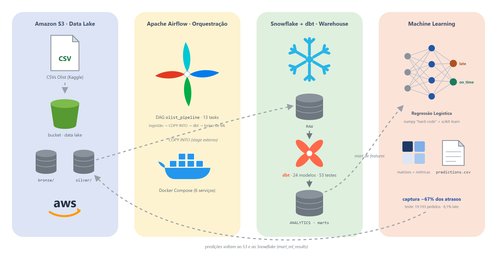

# Pipeline de Dados em Nuvem para ML — Olist Brazilian E-Commerce

Projeto final integrado (IFG — Pós-graduação em IA Aplicada, Módulo 2). Pipeline completo:
ingestão em S3 → transformação → carga no Snowflake → modelagem dbt → previsão de atraso na
entrega (hard-code + scikit-learn) → dashboard Metabase, orquestrado pelo Airflow via
Docker/docker-compose. Enunciado completo em [`docs/Cronograma Projeto Trabalho.md`](docs/Cronograma%20Projeto%20Trabalho.md).

## Problema

Previsão de atraso na entrega de pedidos (`is_late`) do marketplace Olist, para apoiar um
gestor de operações/logística a priorizar intervenção (troca de transportadora, aviso
proativo ao cliente) em pedidos com risco alto de atraso. Detalhes em
[`docs/problema.md`](docs/problema.md).

## Arquitetura



```
data/raw/ (9 CSVs Olist + tradução de categoria) --> aws/s3/processing.py --> data/processed/
   --> S3 (bronze/silver) --> Snowflake RAW (COPY INTO)
   --> dbt (staging/dim/fact/marts) --> ANALYTICS
   --> machine-learning/ (regressão logística hard-code + sklearn) --> predictions --> S3/Snowflake
   --> ANALYTICS.mart_ml_results / mart_delivery_kpis / mart_sentiment_kpis --> Metabase (dashboard)
```

Diagramas completos (implementação híbrida + arquitetura 100% AWS equivalente) em
[`docs/arquitetura.md`](docs/arquitetura.md). Tudo orquestrado pelo Airflow
(`airflow/dags/olist_pipeline_dag.py`).

## Estrutura do repositório

```
aws/terraform/       provisionamento do bucket S3 (Terraform, rodado via Docker)
aws/s3/              scripts de ingestão/normalização/upload (boto3 + pandas)
aws/cloudformation/  template.yaml da arquitetura 100% AWS equivalente + custos
aws/arquitetura/     proposta detalhada da arquitetura 100% AWS (documento canônico)
snowflake/           SQL de setup (warehouse/db/stage) + runner Python
dbt/                 projeto dbt (staging, dimensions, facts, ml, dashboard marts + testes)
airflow/             Dockerfile da imagem custom + DAG do pipeline
machine-learning/    previsão de atraso na entrega: baseline, hard-code (numpy) e sklearn
dashboard/           setup e cards do dashboard Metabase
docs/                arquitetura, dicionário de dados, definição do problema, avaliação
data/                cache local de dados (raw versionado, processed não) — ver data/README.md
docker-compose.yml   orquestra Airflow (LocalExecutor) + Metabase
```

## Quickstart

Pré-requisitos: **Docker** e **Docker Compose** para todo o stack, mais **Python 3.11+** local
apenas para o passo único de provisionamento do Snowflake (passo 4 abaixo).

### 1. Configurar credenciais

```bash
cp .env.example .env
# preencha AWS_* e SNOWFLAKE_* no .env
```

- **AWS**: crie um usuário IAM com permissão de `s3:*` no bucket do projeto (free tier). Em
  contas de laboratório (AWS Academy Learner Lab), as credenciais são temporárias e expiram
  em algumas horas — atualize `AWS_ACCESS_KEY_ID`/`AWS_SECRET_ACCESS_KEY`/`AWS_SESSION_TOKEN`
  sempre que expirarem.
- **Snowflake**: crie uma conta trial em https://signup.snowflake.com/ (ou use a conta de
  laboratório fornecida pela disciplina).

Sem credenciais reais ainda? Deixe `PIPELINE_USE_SAMPLE_DATA=true` no `.env` — o treino do ML
roda com dados sintéticos gerados em memória (ver `machine-learning/README.md`), exceto as
etapas que exigem S3/Snowflake de fato (ingestão, carga, dbt).

### 2. Os dados já estão no repositório

Os 9 CSVs do dataset [Olist Brazilian E-Commerce](https://www.kaggle.com/datasets/olistbr/brazilian-ecommerce)
(mais a tabela de tradução de categoria) já estão em `data/raw/` — não é necessário baixar
nada do Kaggle. Ver `data/README.md` para o detalhe de cada arquivo.

### 3. Provisionar o bucket S3 (Terraform, via Docker)

```bash
cd aws/terraform
cp terraform.tfvars.example terraform.tfvars   # ajuste bucket_name (mesmo valor de AWS_S3_BUCKET)
./tf.sh init
./tf.sh apply
cd ../..
```

Detalhes e alternativa com `docker run` direto em `aws/terraform/README.md`. Só roda uma vez —
igual ao setup do Snowflake abaixo, é infraestrutura, não faz parte do DAG do Airflow.

### 4. Provisionar o Snowflake (uma vez)

```bash
# requer Python local: pip install -r airflow/requirements.txt (inclui snowflake-connector-python)
python snowflake/load_to_snowflake.py --steps setup,stage,tables
```

O stage usa as credenciais AWS do `.env` diretamente (sem passo manual na AWS) — o motivo e a
alternativa via Storage Integration estão em `snowflake/README.md`. O step `grants` é opcional
e costuma falhar em contas de laboratório (ver a mesma página antes de usá-lo).

### 5. Subir o stack

```bash
docker compose up -d --build
```

- Airflow: http://localhost:8080 (usuário/senha em `AIRFLOW_ADMIN_USER`/`AIRFLOW_ADMIN_PASSWORD`)
- Metabase: http://localhost:3000 (setup inicial + conexão Snowflake, ver `dashboard/README.md`)

### 6. Rodar o pipeline

```bash
docker compose exec airflow-webserver airflow dags trigger olist_pipeline
```

Acompanhe as tasks na UI do Airflow. Ao final, `mart_ml_results`, `mart_delivery_kpis` e
`mart_sentiment_kpis` estarão disponíveis no Snowflake para o Metabase.

### Rodando módulos individualmente (fora do Airflow)

Cada pasta (`aws/terraform/`, `aws/s3/`, `snowflake/`, `dbt/`, `machine-learning/`) tem seu próprio README com
instruções para rodar localmente (`pip install -r requirements.txt` + script), útil para
desenvolvimento e debug sem depender do DAG completo.

## Checklist do enunciado

| Item | Onde |
|---|---|
| AWS (S3) | `aws/terraform/` (provisionamento) + `aws/s3/` (ingestão), bucket real (seção 4.5) |
| Snowflake | `snowflake/` |
| dbt (staging/dimensions/facts + testes + docs) | `dbt/` |
| Airflow (DAG funcional) | `airflow/dags/olist_pipeline_dag.py` |
| Pipeline Airflow → S3 → dbt → Snowflake | DAG `olist_pipeline` |
| Dataset estruturado + não estruturado | `docs/dicionario_dados.md` (pedidos/itens/pagamentos estruturados + texto de reviews) |
| Modelagem de dados | `dbt/olist_pipeline/models/marts/` (star schema) |
| ML hard-code + biblioteca, comparação | `machine-learning/hardcode_logistic_regression.py` + `sklearn_model.py` |
| Template CloudFormation | `aws/cloudformation/template.yaml` |
| Diagrama arquitetural 100% AWS | `aws/arquitetura/ArquiteturaAWS.md` |
| Dashboard (Metabase) | `dashboard/README.md` |
| Conjunto/critérios de avaliação | `docs/avaliacao.md` |

## Limitações conhecidas

Ver `machine-learning/README.md` e `docs/avaliacao.md` (seção 5.4) para as limitações dos
dados e do modelo, e `aws/cloudformation/README.md` para o que foi deliberadamente deixado de
fora do template 100% AWS (MWAA/QuickSight) e por quê.
